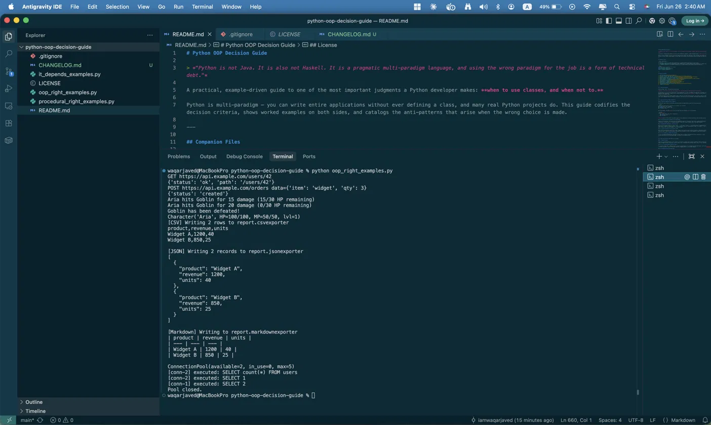
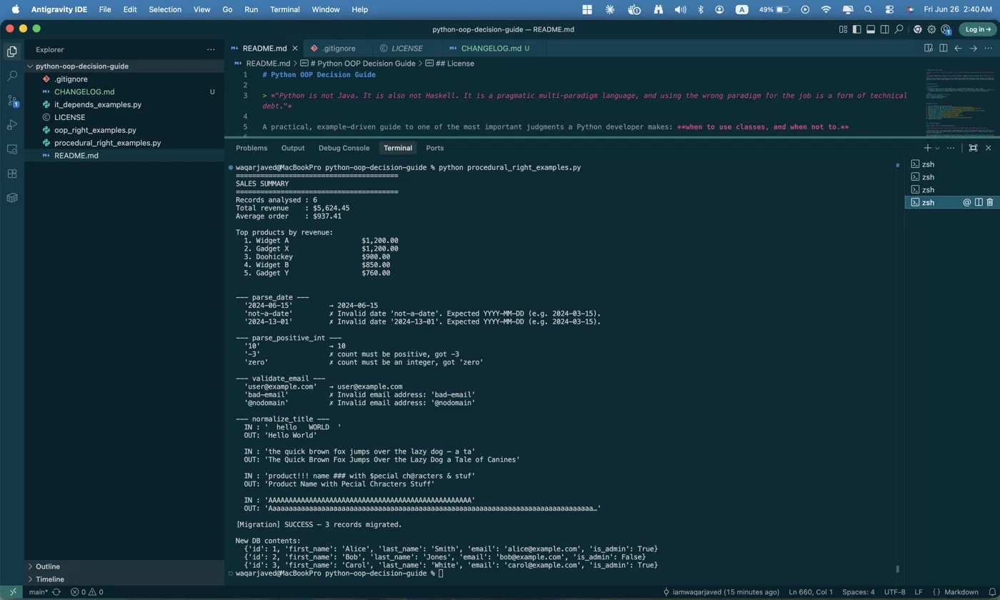
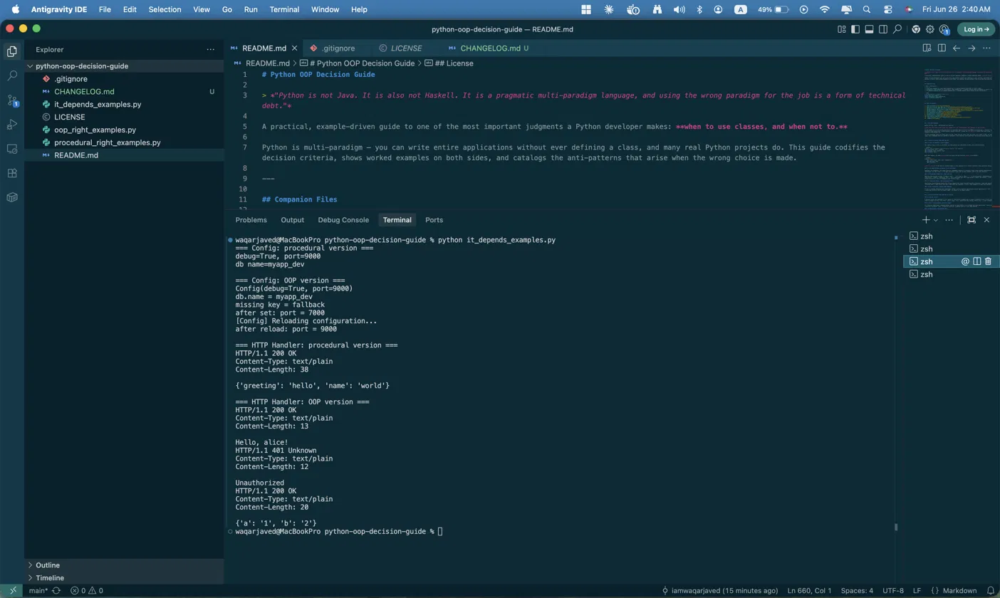

# Python OOP Decision Guide

> *"Python is not Java. It is also not Haskell. It is a pragmatic multi-paradigm language, and using the wrong paradigm for the job is a form of technical debt."*

A practical, example-driven guide to one of the most important judgments a Python developer makes: **when to use classes, and when not to.**

Python is multi-paradigm — you can write entire applications without ever defining a class, and many real Python projects do. This guide codifies the decision criteria, shows worked examples on both sides, and catalogs the anti-patterns that arise when the wrong choice is made.

---

## Companion Files

| File | Description |
|---|---|
| [`oop_right_examples.py`](oop_right_examples.py) | 4 worked examples where OOP is clearly right |
| [`procedural_right_examples.py`](procedural_right_examples.py) | 4 worked examples where procedural is clearly cleaner |
| [`it_depends_examples.py`](it_depends_examples.py) | 2 worked examples where context drives the decision |

```bash
# No dependencies — standard library only
python oop_right_examples.py
python procedural_right_examples.py
python it_depends_examples.py
```

---

## Example Output

`oop_right_examples.py`


`procedural_right_examples.py`


`it_depends_examples.py`


---

## Table of Contents

1. [The Core Question](#1-the-core-question)
2. [Decision Criteria: When OOP Pays Off](#2-decision-criteria-when-oop-pays-off)
3. [Decision Criteria: When OOP Gets in the Way](#3-decision-criteria-when-oop-gets-in-the-way)
4. [Worked Examples: OOP is Clearly Right](#4-worked-examples-oop-is-clearly-right)
5. [Worked Examples: Procedural is Clearly Cleaner](#5-worked-examples-procedural-is-clearly-cleaner)
6. [Worked Examples: It Depends](#6-worked-examples-it-depends)
7. [The @dataclass Discussion](#7-the-dataclass-discussion)
8. [Encapsulation in Python](#8-encapsulation-in-python)
9. [Inheritance vs. Composition](#9-inheritance-vs-composition)
10. [Anti-Pattern Register](#10-anti-pattern-register)
11. [Quick-Reference Decision Flowchart](#11-quick-reference-decision-flowchart)
12. [Summary](#12-summary)

---

## 1. The Core Question

Before writing `class`, ask yourself one question:

**Does this thing have *both* state that changes over time *and* behavior that operates on that state?**

If the answer is no — if you only have data, or only have logic — a class is probably the wrong tool. A function transforms input into output. A dict or dataclass holds named data. A module groups related functions. Classes are for *objects*: things that know things *and* do things, whose internal state evolves as the program runs.

The multi-paradigm nature of Python means you pay a real cost for every class you write: more lines to read, an indirection layer between the caller and the logic, and a namespace decision (method or function?). That cost has to be justified. The sections below show you when it is.

---

## 2. Decision Criteria: When OOP Pays Off

### 2.1 State and Behavior Travel Together

The clearest sign a class is warranted: you keep passing the same bundle of data into related functions.

```python
# Smell: data and behavior keep showing up together, but separated
def connect(host, port, timeout):   ...
def send(host, port, timeout, msg): ...
def close(host, port):              ...
```

When that happens, the data *wants* to be the object and the functions *want* to be methods:

```python
class Connection:
    def __init__(self, host, port, timeout=30): ...
    def send(self, msg): ...
    def close(self): ...
```

**Rule of thumb:** If the same 3+ variables appear in the signature of 3+ related functions, those variables belong in `__init__`.

### 2.2 You Need Multiple Instances of the Same Shape

Functions are singletons. You cannot have two independent copies of a function's local state running simultaneously. If you need ten independent socket connections, ten open files, or ten game characters — each with its own internal state — you need instances.

### 2.3 Polymorphism Simplifies a Decision Tree

When you find yourself writing `if type == "pdf": ... elif type == "docx": ...` in multiple places, polymorphism is trying to emerge. A `Document` base class with a `.render()` method and `PDF` / `Docx` subclasses lets call sites become a single `doc.render()` — the type decision moves to object-construction time and disappears from business logic.

### 2.4 Long-Lived Objects That Accumulate State

Short-lived transformations (parse this string, compute this value) are well-served by functions. Long-lived objects — an HTTP session, a database connection pool, a game entity that gains experience over hundreds of turns — need somewhere to keep state between calls. A class instance is that place.

### 2.5 You're Modeling a Domain with Identity

If you're building something where individual "things" have an identity that persists across operations — a `User`, a `BankAccount`, a `ShoppingCart` — classes map naturally onto that mental model. The object is the domain entity.

---

## 3. Decision Criteria: When OOP Gets in the Way

### 3.1 One-Off Scripts

A 40-line script that downloads a file, parses it, and prints a summary has no reason to define a class. It will never be instantiated twice. There is no state to manage. Writing `class Main:` with a single `run()` method and then calling `Main().run()` is pure ceremony.

### 3.2 Pure Transformations (Stateless Logic)

If a function takes input, computes output, and has no side effects, it is already the right abstraction. `parse_date(s)`, `normalize_phone(number)`, `calculate_tax(amount, rate)` — these are functions. Wrapping them in a class adds nothing.

### 3.3 Configuration and Constant Data

Data that doesn't change and has no behavior is not an object. A module-level dict or a `@dataclass(frozen=True)` communicates your intent better than a class with only `__init__` and no methods.

### 3.4 When a Module Already Provides the Namespace

Python modules *are* namespaces. `math.sin`, `os.path.join`, `json.loads` — these are functions living in modules, not methods on objects. If you're grouping related utilities with no shared state, a module is correct and a class is extra.

### 3.5 Simple Pipelines

Data-in, data-out pipelines — ETL steps, CLI filters, functional transformations — are usually cleaner as a chain of functions or a generator pipeline. Classes introduce mutable state where none is needed.

---

## 4. Worked Examples: OOP is Clearly Right

Full runnable code in [`oop_right_examples.py`](oop_right_examples.py).

### Example 1 — Rate-Limited API Client

**Problem:** Talk to a third-party REST API that enforces 100 requests/minute. Multiple parts of your application make requests, and all of them must share the same rate-limit budget.

**Why OOP:** Shared mutable state (request count, timestamp window, the underlying HTTP session) is the defining trait of this problem. The alternative — a module-level counter and a collection of functions — is just a class without the syntax, and a worse one.

```python
client = RateLimitedClient(base_url="https://api.example.com", rpm_limit=100)
data = client.get("/users/42")   # rate limit tracked internally
```

**The tell:** You cannot write this cleanly as a pure function because the function would need to remember things between calls.

### Example 2 — Game Character

**Problem:** A text RPG where characters have health, mana, and an inventory. They can take damage, cast spells, pick up items, and die.

**Why OOP:** Each character is an independent entity with its own evolving state. You'll create many of them. Their behavior (`.attack()`, `.heal()`, `.pick_up()`) is inseparable from their state (`.health`, `.inventory`).

```python
hero = Character("Aria", health=100, mana=50)
enemy = Character("Goblin", health=30, mana=0)
hero.attack(enemy, damage=15)
```

### Example 3 — File Format Polymorphism

**Problem:** Your application exports reports to PDF, CSV, and HTML. The export logic differs per format, but the call site just wants `exporter.export(data, path)`.

**Why OOP:** This is the textbook polymorphism case. A `ReportExporter` abstract base with concrete subclasses eliminates type-dispatch code from every call site.

```python
for exporter in [CSVExporter(), JSONExporter(), MarkdownExporter()]:
    exporter.export(report_data, path)   # same call, different behavior
```

### Example 4 — Connection Pool

**Problem:** A web server needs to reuse database connections across thousands of requests, checking connections in and out.

**Why OOP:** The pool has persistent state (available connections, borrowed connections, size limits) and behavior that mutates that state over its entire lifetime. This is structurally impossible to express cleanly without an object.

```python
pool = ConnectionPool(min_size=5, max_size=20)
with pool.acquire() as conn:
    conn.execute("SELECT 1")
```

---

## 5. Worked Examples: Procedural is Clearly Cleaner

Full runnable code in [`procedural_right_examples.py`](procedural_right_examples.py).

### Example 5 — CSV Sales Statistics

**Problem:** Read a CSV file of sales records, compute total revenue, average order value, and top 5 products.

**Why Procedural:** This is a pure pipeline. Data goes in, numbers come out. There is no state to maintain between calls, no identity to preserve, no polymorphism to exploit.

```python
records = load_csv("sales.csv")
summary = compute_summary(records)
print_report(summary)
```

A `SalesAnalyzer` class here would be a container for three functions called once, in sequence — that is a module, not a class.

### Example 6 — CLI Argument Validation

**Problem:** A CLI tool that validates user-supplied arguments (date format, positive integer, valid file path).

**Why Procedural:** Each validator is an independent, stateless transformation: string in, validated value or raised exception out. There is no shared state between them.

```python
date  = parse_date(args.start)
count = parse_positive_int(args.n)
path  = resolve_existing_file(args.input)
```

### Example 7 — String Normalization Pipeline

**Problem:** Clean up user-submitted product titles: strip whitespace, title-case, remove special characters, truncate to 80 chars.

**Why Procedural:** A chain of pure, composable transformations. Each step is stateless. A `TitleNormalizer` class would just be a wrapper around one function.

```python
def normalize_title(raw: str) -> str:
    return truncate(remove_special(title_case(raw.strip())), limit=80)
```

### Example 8 — One-Off Data Migration Script

**Problem:** A script run once to migrate user records from a legacy schema to a new one.

**Why Procedural:** This script runs once, from top to bottom. Wrapping it in a class adds a `self` parameter to every function and a `Migration().run()` call at the bottom, with no benefit. When the problem is a script, write a script.

```python
if __name__ == "__main__":
    old_records = fetch_legacy_users(old_db)
    new_records  = [transform_user(r) for r in old_records]
    insert_users(new_db, new_records)
    print(f"Migrated {len(new_records)} users.")
```

---

## 6. Worked Examples: It Depends

Full runnable code in [`it_depends_examples.py`](it_depends_examples.py), showing both versions for each problem.

### Example 9 — Configuration Loader

**Problem:** Load configuration from a JSON source, provide defaults, support environment variable overrides.

**The tension:** Pure configuration data suggests a dict or `@dataclass(frozen=True)`. But once you add lazy loading, dotted key access, or reload-on-demand, *behavior* appears and a class earns its place.

**Procedural** (simpler, right for small projects):
```python
config = load_config_procedural(json_source)
debug = config["app"]["debug"]
```

**OOP** (justified when behavior accumulates):
```python
config = Config(json_source)
config.reload()                          # re-reads and re-applies env overrides
debug = config.get("app.debug", False)   # dotted key access with default
```

**Decision axis:** Does this config object *do* things beyond store-and-retrieve? If yes, class. If no, dict or frozen dataclass.

### Example 10 — HTTP Request Handler

**Problem:** Process an incoming HTTP request: parse headers, route to a handler, build a response.

**The tension:** Each individual operation is a pure function. But the *request lifecycle* — accumulating parsed state across middleware — benefits from an object.

**Procedural** (fine for simple, shallow handlers):
```python
def handle(raw_request: str) -> bytes:
    method, path, qs = parse_request_line(raw_request)
    headers = parse_headers(raw_request)
    return route_and_respond(method, path, qs, headers)
```

**OOP** (justified when middleware attaches state to the request):
```python
request = Request(raw)
auth_middleware(request)    # attaches request.user
trace_middleware(request)   # attaches request.trace_id
return route(request)
```

**Decision axis:** Does middleware need to annotate the request object, or does request state get shared across many call sites within a single request's lifetime? If yes, the class eliminates parameter-passing spaghetti.

---

## 7. The @dataclass Discussion

### When `@dataclass` Replaces a Hand-Written `__init__`

If your class is primarily a named container for typed fields — a record, a value object, a DTO — `@dataclass` eliminates boilerplate `__init__`, `__repr__`, and `__eq__`:

```python
# Before: hand-written boilerplate
class Point:
    def __init__(self, x: float, y: float):
        self.x = x
        self.y = y
    def __repr__(self):
        return f"Point(x={self.x}, y={self.y})"
    def __eq__(self, other):
        return self.x == other.x and self.y == other.y

# After
from dataclasses import dataclass

@dataclass
class Point:
    x: float
    y: float
```

Common options:

```python
@dataclass(frozen=True)   # immutable + hashable → use as dict key or in sets
class Color:
    r: int
    g: int
    b: int

@dataclass(order=True)    # enables <, >, sorting by fields in declaration order
class Version:
    major: int
    minor: int
    patch: int
```

### When `@dataclass` Doesn't Work: Custom Validation

`@dataclass` generates `__init__` for you. When you need to validate or transform arguments, you have two options:

**`__post_init__`** — runs after the generated `__init__` assigns fields. Good for raising on invalid input:

```python
@dataclass
class PositivePoint:
    x: float
    y: float

    def __post_init__(self):
        if self.x < 0 or self.y < 0:
            raise ValueError(f"Coordinates must be non-negative, got ({self.x}, {self.y})")
```

**Hand-written `__init__`** — necessary when you need to transform incoming data or derive fields that shouldn't be stored verbatim:

```python
class BoundingBox:
    def __init__(self, points: list[tuple[float, float]]):
        xs = [p[0] for p in points]
        ys = [p[1] for p in points]
        self.min_x, self.max_x = min(xs), max(xs)
        self.min_y, self.max_y = min(ys), max(ys)
```

**Decision tree:**

```
Does your class primarily hold named data?
├── YES → @dataclass
│   ├── Need validation?      → __post_init__
│   ├── Need immutability?    → frozen=True
│   └── Need ordering?        → order=True
└── NO (complex init logic, transformation)
    └── write __init__ by hand
```

### `@dataclass` vs. `typing.NamedTuple`

| | `@dataclass(frozen=True)` | `NamedTuple` |
|---|---|---|
| Mutable version available | Yes (drop `frozen`) | No |
| Inheritable | Yes | Limited |
| Positional unpacking (`x, y = point`) | No | Yes |
| Dict conversion | `dataclasses.asdict()` | `point._asdict()` |

Use `NamedTuple` when you need positional unpacking or interoperability with code that expects a tuple. Use `@dataclass` for everything else.

---

## 8. Encapsulation in Python

### "We're All Consenting Adults"

Python's encapsulation model is cultural, not enforced. The language trusts developers to respect conventions rather than access-control keywords like Java's `private` or `protected`.

The convention is the **single leading underscore** (`_name`):

```python
class Cache:
    def __init__(self):
        self._store = {}   # internal detail — don't depend on this externally
        self._hits  = 0

    def get(self, key):
        result = self._store.get(key)
        if result is not None:
            self._hits += 1
        return result
```

A single underscore signals: *"implementation detail — you can access it in an emergency, but don't depend on it."* Python will not stop you from reading `cache._store`, but the intent is clear.

**This is sufficient for almost all production Python code.**

### Double Underscore Name Mangling (`__name`) — Almost Never Appropriate

Double underscores trigger name mangling: `__attr` on class `Foo` becomes `_Foo__attr` in bytecode. This was designed for one narrow purpose: preventing accidental attribute collisions in deep inheritance hierarchies where a base class ships to third-party developers.

```python
class Base:
    def __init__(self):
        self.__state = "base"   # stored as _Base__state

class Child(Base):
    def __init__(self):
        super().__init__()
        self.__state = "child"  # stored as _Child__state — no collision
```

Outside that scenario, double underscores make debugging harder, break introspection, and signal a level of "keep out" contrary to Python's philosophy.

**Practical guidance:**

| Intent | Convention |
|---|---|
| Public API | No underscore |
| Internal implementation detail | Single underscore (`_name`) |
| Base class protecting against subclass collision | Double underscore (`__name`) |
| Simulating Java `private` | ❌ Use `_name` instead |

---

## 9. Inheritance vs. Composition

### Favor Composition Over Inheritance

The contemporary Python community has largely settled on this heuristic. Inheritance is a powerful tool with a narrow valid use case, and it is routinely overused by developers from Java-heavy backgrounds.

### When Inheritance Is Appropriate: True Is-A Relationships

Inheritance is correct when you can honestly complete this sentence:

> "A `[Subclass]` *is a* `[Superclass]`."

- A `Dog` *is an* `Animal` ✓
- A `SavingsAccount` *is a* `BankAccount` ✓
- A `PDFExporter` *is a* `ReportExporter` ✓

The **Liskov Substitution Principle** gives you a concrete test: every place the base class is used, you must be able to substitute the subclass without breaking anything. If you can't, the inheritance relationship is wrong.

### When to Compose Instead

When the relationship is "has-a" or "uses-a," use composition:

```python
# Wrong: Employee IS-NOT-A Database
class Employee(Database):
    def save(self):
        self.execute("INSERT ...")

# Right: Employee HAS-A database connection
class Employee:
    def __init__(self, db: Database):
        self._db = db

    def save(self):
        self._db.execute("INSERT ...")
```

Composition lets you swap `self._db` for a test double, a different driver, or an in-memory store without touching `Employee`. Inheritance locks you in.

### Warning: Deep Class Hierarchies

A hierarchy more than two levels deep is a design smell. Each additional level adds cognitive load — you must trace through multiple `__init__` calls, `super()` chains, and the MRO to understand what `self` looks like at runtime.

```python
# Deep hierarchy → fragile
class Vehicle: ...
class MotorVehicle(Vehicle): ...
class Car(MotorVehicle): ...
class ElectricCar(Car): ...      # four levels deep

# Composition alternative
class ElectricCar:
    def __init__(self):
        self.drivetrain = ElectricDrivetrain()
        self.body       = CarBody()
        self.battery    = Battery(capacity_kwh=75)
```

---

## 10. Anti-Pattern Register

### Anti-Pattern 1: Excessive Getters and Setters (Java-in-Python)

Java requires getters/setters because attributes are `private`. In Python, attributes are public by convention. Wrapping every attribute in a getter/setter pair is pure noise.

```python
# ANTI-PATTERN
class Rectangle:
    def get_width(self):  return self._width
    def set_width(self, v): self._width = v

# IDIOMATIC: plain attributes; add @property only when logic is needed
class Rectangle:
    def __init__(self, width: float, height: float):
        self.width  = width
        self.height = height

    @property
    def area(self) -> float:
        return self.width * self.height

# @property with validation — only when you actually need it
class SafeRectangle:
    @property
    def width(self) -> float:
        return self._width

    @width.setter
    def width(self, value: float) -> None:
        if value <= 0:
            raise ValueError(f"Width must be positive, got {value}")
        self._width = value
```

### Anti-Pattern 2: Unnecessary Class Hierarchies

Building hierarchies before the use cases exist produces abstractions that fit nothing:

```python
# ANTI-PATTERN: speculative hierarchy with one concrete case
class BaseProcessor:
    def process(self, data): raise NotImplementedError

class TextProcessor(BaseProcessor):
    def process(self, data): ...
```

Add the base class when you have the second or third concrete case — not before.

### Anti-Pattern 3: Classes That Should Be Modules

A class with only `@staticmethod` methods, no instance state, and no instantiation is a module wearing a class costume:

```python
# ANTI-PATTERN
class MathUtils:
    @staticmethod
    def add(a, b): return a + b
    @staticmethod
    def clamp(v, lo, hi): return max(lo, min(hi, v))

# IDIOMATIC: math_utils.py
def add(a, b): return a + b
def clamp(v, lo, hi): return max(lo, min(hi, v))
```

### Anti-Pattern 4: `__init__` That Does Real Work

`__init__` should initialize state, not make network calls, read files, or compute expensive results. Use a `@classmethod` factory instead:

```python
# ANTI-PATTERN
class UserProfile:
    def __init__(self, user_id: int):
        self.data = requests.get(f"/api/users/{user_id}").json()  # ← wrong

# IDIOMATIC
class UserProfile:
    def __init__(self, user_id: int):
        self.user_id = user_id
        self.data = None

    @classmethod
    def load(cls, user_id: int) -> "UserProfile":
        profile = cls(user_id)
        profile.data = requests.get(f"/api/users/{user_id}").json()
        return profile
```

### Anti-Pattern 5: Subclassing for Code Reuse Alone

Inheriting from a class to borrow its methods — without a genuine is-a relationship — creates brittle coupling:

```python
# ANTI-PATTERN: inheriting list just to add sum_all
class MyList(list):
    def sum_all(self):
        return sum(self)

# IDIOMATIC: just a function
def sum_all(items):
    return sum(items)
```

---

## 11. Quick-Reference Decision Flowchart

```
START: I need to write some Python code.
│
├── Does it have BOTH state that changes AND behavior on that state?
│   ├── NO  → Write functions. Use a module for namespace.
│   └── YES ↓
│
├── Will I need MULTIPLE INDEPENDENT INSTANCES?
│   ├── NO  → Consider a module-level singleton or simple class.
│   └── YES → Strong signal for a class. ↓
│
├── Is it primarily a DATA RECORD (fields + maybe a few methods)?
│   ├── YES → @dataclass
│   │         ├── Need validation?           → __post_init__
│   │         ├── Need immutability?         → frozen=True
│   │         └── Complex init transforms?  → write __init__ by hand
│   └── NO  → Write a regular class. ↓
│
├── Does the class INHERIT from something?
│   ├── "[Child] IS-A [Parent]" honestly? → Inheritance OK
│   └── NO → Use COMPOSITION (has-a)
│
└── Check the anti-pattern register before committing:
    ├── Getters/setters on every attribute? → Use plain attributes
    ├── Only static methods?               → Use a module
    ├── __init__ making network calls?     → Extract to @classmethod factory
    └── Hierarchy more than 2 levels?      → Flatten with composition
```

---

## 12. Summary

| Situation | Recommended Approach |
|---|---|
| Pure data transformation | Functions |
| Related utilities, no shared state | Module |
| Named data record, simple | `@dataclass` |
| Named data record, immutable | `@dataclass(frozen=True)` |
| Named data record, complex init | Hand-written `__init__` |
| Object with evolving state + behavior | Regular class |
| Multiple independent instances | Regular class |
| Polymorphic dispatch across types | Inheritance (is-a) or `Protocol` |
| Reusing code from another class | Composition (has-a) |
| One-off scripts | Top-level functions, no class |
| Configuration data | Dict, frozen dataclass, or `Config` class |
| Deep hierarchy (> 2 levels) | Refactor to composition |
| Static-only utility class | Module |

**The single most important shift from Java to Python: start with functions.** Reach for a class when state and behavior are genuinely inseparable, when you need multiple independent instances, or when polymorphism will simplify your call sites. Let the problem tell you when an object is needed — don't impose one.

---

## Module

Produced as part of **Module 7: OOP in Python** coursework at Atlantis University.

## License

[MIT](LICENSE)